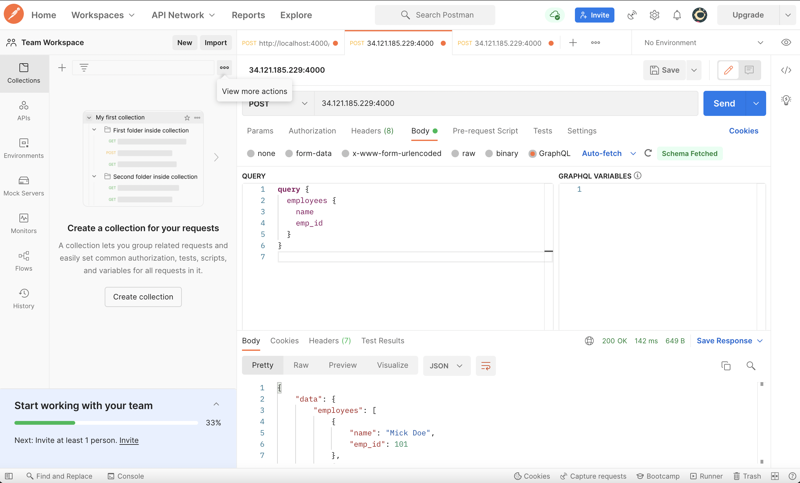

### This assignment has a GraphQL API connected to a Neo4J database, and a Python client to perform two operations on the database
<br>
### No setup is required to use the API and/or run the Python client
<br>
The GraphQL API is running on Google Compute Engine at <http://34.121.185.229:4000/>
<br>
Neo4j running in AuraDB Free at neo4j+s://2a236cd7.databases.neo4j.io
<br>
Python client (Jupyter notebook) running on the server at <http://34.121.185.229:8888/>
<br>
For the database-
Database Browser URI: *https://2a236cd7.databases.neo4j.io/browser/*
Username: *neo4j*
Password: *password*

For the database:
Created a *uniqueness constraint on emp_id* to make sure we don't have duplicate emp_ids using Cypher query:

```
    CREATE CONSTRAINT emp_id_constraint 
    FOR (e:Employee)
    REQUIRE e.emp_id IS UNIQUE
```

Schema of the database:
    Node (Employee): Each Employee node will have 2 properties- name (Employee name in string format) and emp_id (Employee ID in integer format)

GraphQL API (providing two operations):

1. Mutation to create an Employee node with name and emp_id

```
mutation {
    createEmployees(input: [
        {
            name: <employee name as a string>
            emp_id: <employee id as an integer>
        }
    ]) {
        employees {
            name
            emp_id
        }
    }
}
```

2. Query to get a list of all the employees

```
query {
  employees {
    name
    emp_id
  }
}
```

How to test the API:

1. Using Python Client:
    Access the client using the URL: <http://34.121.185.229:8888/>
    Open the "pythonAsClient" Jupyter notebook
    When running the notebook:
    - To add an employee node, run the *mutation code blocks* after replacing the name and the emp_id values to create the node with the corresponding values.
    - To display all the employees, run the *query code blocks*. It will also display the data in a dataframe.
<br>
2. Using cURL

<br>
a. cURL query

```
    curl 'http://34.121.185.229:4000/' \
    -X POST \
    -H 'content-type: application/json' \
    --data '{
        "query": "query{employees { name emp_id } }"
    }'
```

<br>
b. cURL mutation

Please make sure you enter a name (value for the key "name") and the employee id ( value for the key "emp_id") 


```    
    curl 'http://34.121.185.229:4000/' \
            -X POST \
            -H 'content-type: application/json' \
            --data '{
                "query":"mutation { createEmployees(input:[ { name:\"Jane Doe\" emp_id:101 }, ]) { employees { name emp_id } } }"
            }'
```


3. Using Postman:
a. Download [Postman](https://www.postman.com/downloads/)
b. Select POST in dropdown menu for requests
c. Enter the request URL as the API URL: http://34.121.185.229:4000
d. Select GraphQL in under Body tab
e. Input Query/Mutation as outlined above (in the GraphQL API section - *make sure you enter name and emp_id in the Mutation*)
f. Hit Send button

Screenshots for reference attached below:

Mutation in Postman:


Query in Postman:


Results are being returned to a Python client using two methods :
1. Calling the GraphQL API query (as outlined in the "How to test API #1 Using Python Client")
2. Using a Python driver to directly query the database (see Method 2 in the notebook)
